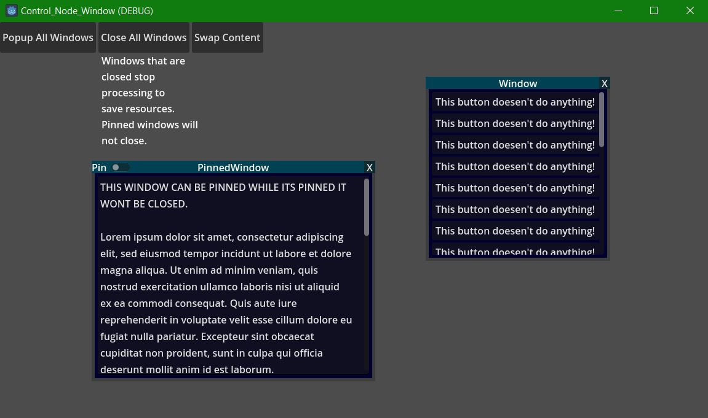

# Control Node Window

The **Control Node Window** is a Node for creating control node-based windows in Godot, complete with usage examples.  

## Key Features:  
- **Control Compatibility:** Must be a child of a control node to function properly.  
- **Flexible Child Nodes:** Designed to work with child nodes such as `ScrollContainer`, `TextEdit`, and similar control nodes.  
- **Canvas Layer / Viewport Independence:** Operates without utilizing any canvas layers.

## Usage:  
To use the `control_node_window.tscn`, attach it as a child of a suitable control node. Add a compatible node like `ScrollContainer` or `TextEdit` as its child for optimal functionality.  

